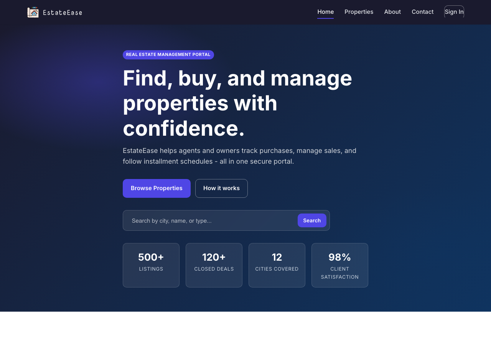
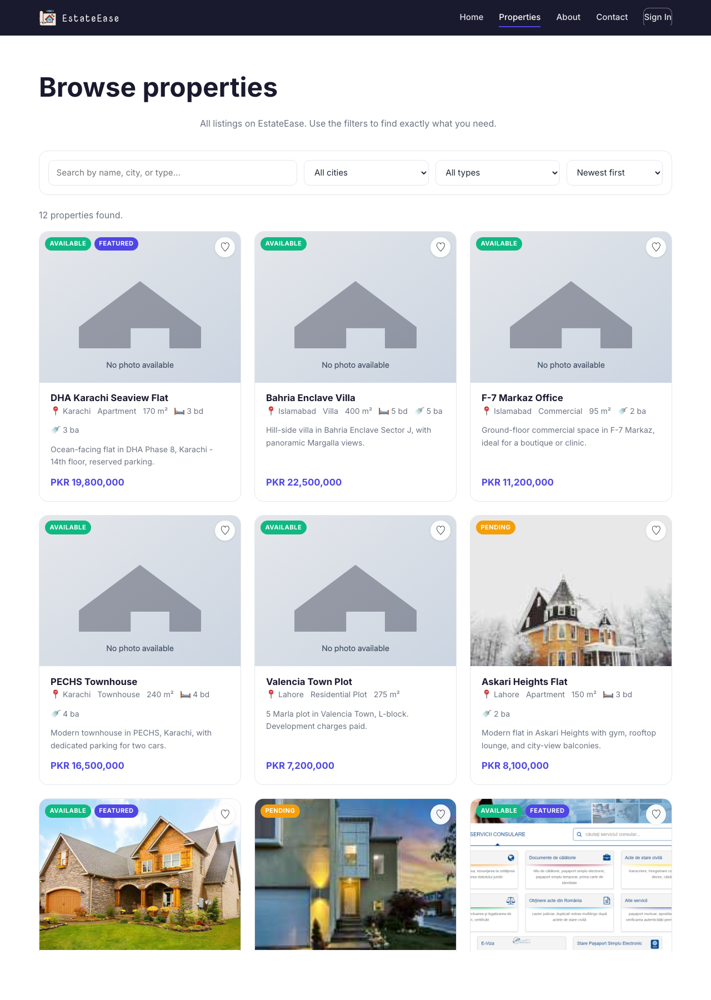

# RealEstate Web Application (EstateEase)

> The smarter way to manage real estate. A portfolio-grade Web Application Development (WAD) project: a responsive, database-backed real estate portal with a static GitHub Pages preview **and** a full PHP/MySQL application.

<p align="left">
  
  
  
  
  
  
  
  
</p>



---

## Table of contents

1. [Overview](#1-overview)
2. [Live demo](#2-live-demo)
3. [Feature tour](#3-feature-tour)
4. [Architecture](#4-architecture)
5. [Tech stack](#5-tech-stack)
6. [Folder structure](#6-folder-structure)
7. [Database design](#7-database-design)
8. [Security model](#8-security-model)
9. [Running it locally](#9-running-it-locally)
10. [Deploying to GitHub Pages](#10-deploying-to-github-pages)
11. [Deploying the PHP app](#11-deploying-the-php-app)
12. [Continuous integration](#12-continuous-integration)
13. [Page catalogue](#13-page-catalogue)
14. [Screenshots](#14-screenshots)
15. [What was enhanced from the original July 2024 submission](#15-what-was-enhanced-from-the-original-july-2024-submission)
16. [Roadmap](#16-roadmap)
17. [Author](#17-author)
18. [License](#18-license)

---

## 1. Overview

EstateEase is a real estate management portal originally built in **July 2024** as the capstone for a Web Application Development course at the University of Central Punjab (UCP), Lahore. It was rebuilt to portfolio quality with stronger security, a modern responsive design system, a static GitHub Pages preview, CI/CD, and end-to-end documentation.

Two deliverables ship side by side:

| Deliverable                  | Folder      | What it does                                                                                 | Where it runs                                  |
| ---------------------------- | ----------- | -------------------------------------------------------------------------------------------- | ---------------------------------------------- |
| **Static marketing site**    | `public/`   | Beautiful landing, responsive property listings with client-side search/filter, contact form | **GitHub Pages** (primary), any static host    |
| **PHP application**          | `app/`      | Authenticated portal: sign up / sign in, dashboard, add purchases, record sales, file uploads | XAMPP, MAMP, Docker, Render, InfinityFree      |

Both deliverables share the same design system (`assets/css/styles.css`) so visitors get a seamless brand experience whether they land on the Pages preview or the full PHP app.

---

## 2. Live demo

| Preview                                               | URL                                                                                       |
| ----------------------------------------------------- | ----------------------------------------------------------------------------------------- |
| **Static site (GitHub Pages)**                        | `https://QiratFatima0142.github.io/RealEstate-Web-Application/`                           |
| **PHP app**                                           | Run locally with XAMPP or Docker - see [Running it locally](#9-running-it-locally).       |

> Seeded demo account (PHP app): `qirat@estateease.test` - password **`password`**.

---

## 3. Feature tour

### Public (no login needed)

- Hero landing with animated gradient background, search bar, and stats.
- Responsive property listings loaded from `public/data/properties.json`.
- Client-side filtering by **city**, **type**, and **search query**, plus four sort options (newest, price up/down, largest).
- Per-property `featured`, `available`, `pending`, and `sold` badges.
- "Save to favourites" button that persists through **`localStorage`**.
- Contact form with client-side validation and accessible flash messages.
- Dedicated About, Privacy, Terms, and 404 pages.

### Authenticated (PHP app)

- **Sign up** and **sign in** with bcrypt-hashed passwords and session regeneration.
- **Dashboard** showing total purchases, portfolio value, total sold, and revenue received.
- **Add a purchase** with name, amount, area, date, and photo upload (JPEG / PNG / WebP up to 4 MB, sanitised filename).
- **Sell a property** (one-to-one with purchase) with partial-payment support (received amount, outstanding balance, next installment date).
- **Sold properties** table with per-row status badges (**Paid in full**, **Installment due**, **Outstanding**).
- **Browse properties** with the same filters as the static site, plus a `scope=mine` flag for the current user's portfolio.
- Flash messages, CSRF-protected forms, and a logout that fully tears down the session.

---

## 4. Architecture

```
+-----------------------------------------------------------------+
|                         End user                                |
+----------------------+------------------+-----------------------+
                       |                  |
                       |  static HTML     |  authenticated HTML
                       v                  v
+--------------------------+   +--------------------------------+
|  public/ (GitHub Pages)  |   |  app/ (PHP 8 on Apache / PHP   |
|  - index.html            |   |       built-in server / Docker)|
|  - properties.html       |   |  - includes/  (config, db,     |
|  - about / contact / ... |   |     auth, helpers, header,     |
|  - data/properties.json  |   |     footer)                    |
|  - assets/css|js|images  |   |  - actions/   (form handlers,  |
|                          |   |     CSRF-verified)             |
|  Loaded via fetch,       |   |  - *.php views                 |
|  filtered in the browser |   |  - uploads/   (user photos)    |
+--------------------------+   +---------------+----------------+
                                               |
                                               v
                               +----------------------------------+
                               |         MySQL 8                  |
                               |  users, purchase, soldproperty,  |
                               |  contact_message                 |
                               +----------------------------------+
```

- **No build step.** Both deliverables are hand-written HTML / CSS / JS / PHP.
- **Shared styles.** `public/assets/css/styles.css` and `app/assets/css/styles.css` are identical copies of one design system.
- **Pages deployment is automated.** The `Deploy static site to GitHub Pages` workflow uploads `public/` as an artifact on every push to `main`.

---

## 5. Tech stack

| Layer           | Technology                                                  |
| --------------- | ----------------------------------------------------------- |
| Markup          | HTML5 (semantic sectioning, ARIA-friendly nav)              |
| Styling         | CSS3 with custom properties, responsive grid, mobile nav    |
| Client scripts  | Vanilla JavaScript (ES2020), no frameworks, no bundler      |
| Server          | PHP 8.2 using PDO + prepared statements                     |
| Database        | MySQL 8 (InnoDB, utf8mb4, FKs with cascade, check constraints) |
| Fonts           | Google Fonts - Inter (body) + Nova Mono (brand wordmark)     |
| CI              | GitHub Actions - MySQL 8 service, HTML validator, asset check |
| Hosting         | GitHub Pages (static) + any PHP host (app)                  |
| Quality tools   | `php -l` (syntax), `html-validate`, JSON schema validation  |

---

## 6. Folder structure

```
RealEstate-Web-Application/
|-- .editorconfig                # shared editor settings
|-- .gitattributes               # Linguist + EOL normalisation
|-- .gitignore                   # OS / editor / uploads noise
|-- .github/workflows/
|   |-- ci.yml                   # PHP + MySQL + static-site checks
|   +-- pages.yml                # deploys public/ to GitHub Pages
|-- LICENSE                      # MIT
|-- README.md                    # this file
|
|-- app/                         # --- PHP / MySQL application ---
|   |-- index.php                # public landing (PHP variant)
|   |-- login.php / signup.php
|   |-- forgot_password.php
|   |-- dashboard.php
|   |-- properties.php           # search + filter + sort
|   |-- add_purchase.php
|   |-- add_sold.php
|   |-- sold.php                 # sold + installment table
|   |-- about.php / contact.php
|   |-- privacy.php / terms.php
|   |-- includes/
|   |   |-- config.php           # env + session bootstrap
|   |   |-- db.php               # PDO singleton + helpers
|   |   |-- auth.php             # login/logout, bcrypt, require_login
|   |   |-- helpers.php          # e(), csrf_token, flash_set, ...
|   |   |-- header.php           # shared navbar + flash banner
|   |   +-- footer.php           # shared footer + script include
|   |-- actions/                 # POST handlers (CSRF-verified)
|   |   |-- login.php / signup.php / logout.php
|   |   |-- purchase_add.php
|   |   |-- sold_add.php
|   |   +-- contact.php
|   |-- assets/                  # same design system as public/
|   |   |-- css/styles.css
|   |   |-- js/app.js
|   |   +-- images/
|   +-- uploads/                 # user-uploaded property photos
|
|-- public/                      # --- Static site (GitHub Pages) ---
|   |-- index.html               # hero, features, featured grid
|   |-- properties.html          # full listings with filters
|   |-- about.html / contact.html
|   |-- 404.html
|   |-- pages/
|   |   |-- privacy.html
|   |   +-- terms.html
|   |-- data/
|   |   +-- properties.json      # listing dataset
|   +-- assets/
|       |-- css/styles.css
|       |-- js/main.js           # nav toggle + reveal animation
|       |-- js/properties.js     # fetch + render + filter + favourites
|       |-- js/contact.js        # contact form validation
|       +-- images/
|           |-- favicon.svg / logo.svg / placeholder.svg
|           +-- properties/      # sample property photos
|
|-- database/
|   |-- schema.sql               # tables, FKs, indexes, checks
|   +-- seed.sql                 # 3 users, 7 purchases, 3 sales, 2 messages
|
+-- docs/
    |-- DEPLOYMENT.md            # XAMPP, Docker, Pages, InfinityFree
    +-- images/                  # README screenshots
        |-- home.png
        +-- properties.png
```

Line counts at a glance:

| Area              | Files | Approx. LoC |
| ----------------- | -----:| -----------:|
| PHP application   | 22    | ~1500       |
| Static site       | 7 HTML + 3 JS | ~1200 |
| Shared CSS        | 1     | ~520        |
| SQL (schema+seed) | 2     | ~150        |
| CI / config       | 5     | ~180        |
| Docs              | 2     | ~520        |

---

## 7. Database design

The schema lives in [`database/schema.sql`](database/schema.sql) and is fully reproducible in CI.

### Entity relationships

```
+------------------+         +------------------+         +--------------------+
|      users       | 1 --- N |     purchase     | 1 --- 1 |    soldproperty    |
|------------------|         |------------------|         |--------------------|
| id (PK)          |         | id (PK)          |         | id (PK)            |
| email (UQ)       |         | user_id (FK)     |         | purchase_id (FK,UQ)|
| password_hash    |         | name             |         | sold_date          |
| first_name       |         | total_amount     |         | total_amount       |
| last_name        |         | area_sqm         |         | received_amount    |
| created_at       |         | purchase_date    |         | next_date          |
+------------------+         | photo            |         | created_at         |
                             | created_at       |         +--------------------+
                             +------------------+

+------------------+
| contact_message  |   (standalone - public contact form submissions)
+------------------+
```

### Tables

| Table              | Columns                                                                                       | Notes                                                                                                                                                     |
| ------------------ | --------------------------------------------------------------------------------------------- | --------------------------------------------------------------------------------------------------------------------------------------------------------- |
| `users`            | `id`, `email` (unique), `password_hash`, `first_name`, `last_name`, `created_at`              | Password stored as **bcrypt** hash. Check constraint on `email LIKE '%@%'`.                                                                               |
| `purchase`         | `id`, `user_id` (FK -> users), `name`, `total_amount` (DECIMAL 14,2), `area_sqm`, `purchase_date`, `photo`, `created_at` | Cascade delete when a user is removed. Indexes on `user_id` and `purchase_date`. Check: amount > 0, area > 0. |
| `soldproperty`     | `id`, `purchase_id` (FK -> purchase, **unique**), `sold_date`, `total_amount`, `received_amount`, `next_date`, `created_at` | One-to-one with `purchase`. Check: `received <= total`.                                                       |
| `contact_message`  | `id`, `name`, `email`, `message`, `created_at`                                                | Populated by the public contact form.                                                                                                                     |

### Why this shape?

- The original July 2024 schema stored **passwords as INT** and used `TEXT` for names and areas. The refactor fixes both, plus adds FK cascade rules and monetary `DECIMAL(14, 2)` columns.
- `soldproperty.purchase_id` is **unique** because a property can only be sold once in the domain model.
- Every table has `created_at TIMESTAMP DEFAULT CURRENT_TIMESTAMP` for simple auditing.
- `CHECK` constraints enforce non-negative money fields at the database level.
- Indexes on `purchase.user_id`, `purchase.purchase_date`, and `soldproperty.sold_date` keep the dashboard queries fast.

See the [diff table in section 15](#15-what-was-enhanced-from-the-original-july-2024-submission) for every change from the original schema.

---

## 8. Security model

The PHP app is a student project, but it is written to production-grade security defaults so it can be shown off in interviews:

| Threat                              | Mitigation                                                                                                   |
| ----------------------------------- | ------------------------------------------------------------------------------------------------------------ |
| SQL injection                       | **PDO with bound parameters** everywhere. No string concatenation into SQL.                                  |
| Stored passwords                    | `password_hash($pw, PASSWORD_BCRYPT)` + `password_verify` on login. Hashes are 60 bytes, never the plain text. |
| Session hijacking                   | `session_regenerate_id(true)` on login, `HttpOnly` + `SameSite=Lax` cookies, full session teardown on logout. |
| Cross-site request forgery (CSRF)   | Every POST form includes `csrf_field()`. Handlers call `csrf_verify()` before touching the DB.                |
| Cross-site scripting (XSS)          | All user-supplied strings are rendered with `e()` - a tight `htmlspecialchars` wrapper.                       |
| File-upload abuse                   | Whitelist of `jpg`, `jpeg`, `png`, `webp`. 4 MB size cap. Random suffix on saved filename.                    |
| Unauthorised actions                | `require_login()` at the top of every protected page. Ownership checks before recording a sale.               |
| Clickjacking / MIME sniffing        | Sent via `php.ini` / web-server config in production (not committed here).                                    |

---

## 9. Running it locally

### Static site (60 seconds)

```bash
cd public
python3 -m http.server 8000
# open http://localhost:8000
```

That's it. No database, no build step. JSON is loaded via `fetch`, filters happen in the browser, favourites persist through `localStorage`.

### PHP app (3 minutes)

**Prerequisites:** PHP 8.0+ and MySQL 8 (XAMPP or MAMP bundles both).

```bash
# 1. Import the schema + sample data
mysql -uroot -p < database/schema.sql
mysql -uroot -p < database/seed.sql

# 2. Launch the PHP built-in server
cd app
php -S localhost:8080

# 3. Visit http://localhost:8080 and sign in with any seeded account
#    (password: "password")
```

Environment overrides (useful for Docker / remote MySQL):

```bash
DB_HOST=db.example.com DB_USER=estateease DB_PASS=secret \
  php -S localhost:8080
```

For the full XAMPP / MAMP / Docker recipes, see [`docs/DEPLOYMENT.md`](docs/DEPLOYMENT.md).

---

## 10. Deploying to GitHub Pages

The static site in `public/` is deployed automatically on every push to `main` via [`.github/workflows/pages.yml`](.github/workflows/pages.yml).

### One-time setup

1. **Push the repo** (you probably already have; see [section 11](#11-deploying-the-php-app) if not).
2. Open **Settings &rarr; Pages**.
3. Under **Build and deployment &rarr; Source**, choose **GitHub Actions**.

That's all. The next push will trigger the `Deploy static site to GitHub Pages` workflow. When it finishes you'll see a **View deployment** button in the job summary.

### Typical URL

```
https://QiratFatima0142.github.io/RealEstate-Web-Application/
```

### Custom domain (optional)

1. Create a `CNAME` file in `public/` with your domain on a single line (`example.com`).
2. In GitHub **Settings &rarr; Pages &rarr; Custom domain**, enter the same domain.
3. Add an `ALIAS` / `CNAME` record at your DNS provider pointing to `QiratFatima0142.github.io`.

---

## 11. Deploying the PHP app

Because GitHub Pages does not execute PHP, the full-stack app needs a server that understands PHP + MySQL. Quick options:

| Host                 | PHP?   | MySQL?   | Notes                                                                          |
| -------------------- | :----: | :------: | ------------------------------------------------------------------------------ |
| **XAMPP / MAMP**     | yes    | yes      | Zero-cost local dev. Copy `app/` into `htdocs/` and import the SQL via phpMyAdmin. |
| **Docker compose**   | yes    | yes      | See the ready-made `docker-compose.yml` snippet in `docs/DEPLOYMENT.md`.         |
| **InfinityFree**     | yes    | yes      | Free hosted PHP. Upload `app/`, import SQL, update DB credentials.              |
| **Render.com**       | yes    | external | Free Web Service tier; point at `app/`, add PlanetScale / Railway MySQL.        |
| **Heroku + ClearDB** | yes    | yes      | Requires paid dynos in 2024+ - not recommended for free use.                   |

Full step-by-step recipes live in [`docs/DEPLOYMENT.md`](docs/DEPLOYMENT.md).

---

## 12. Continuous integration

Two GitHub Actions workflows guard the repo:

### `ci.yml` - runs on every push and PR

- **Job 1 - `php-and-sql`**
  - Installs PHP 8.2 with the `pdo_mysql` + `mbstring` extensions.
  - Syntax-checks every `.php` file with `php -l`.
  - Spins up a MySQL 8 service container, applies `schema.sql`, loads `seed.sql`, and runs row-count sanity queries against every table.
- **Job 2 - `static-site`**
  - Validates `public/data/properties.json` is parseable.
  - Runs `html-validate` over every HTML file in `public/`.
  - Walks every `assets/...` reference in HTML and confirms the file exists on disk (catches typos that would break the deployed Pages site).

### `pages.yml` - deploys the static site

- Uploads `public/` as the Pages artifact.
- Uses the official `actions/deploy-pages@v4` action.
- Adds a commented-out step placeholder where you can inject environment-specific JSON if you ever need to.

Badges, logs, and the live URL are always visible in the **Actions** tab.

---

## 13. Page catalogue

### Static site (`public/`)

| Page               | Path                   | Highlights                                                                |
| ------------------ | ---------------------- | ------------------------------------------------------------------------- |
| Home               | `index.html`           | Hero with search, features grid, featured listings, "how it works" steps |
| Browse properties  | `properties.html`      | Full filter/sort/favourite UI, 12 sample listings                         |
| About              | `about.html`           | Project narrative, architecture tiles, team                              |
| Contact            | `contact.html`         | Validated contact form + direct contact panel                            |
| Privacy            | `pages/privacy.html`   | Data collection policy                                                   |
| Terms              | `pages/terms.html`     | Acceptable use & liability                                               |
| 404                | `404.html`             | Friendly not-found page                                                   |

### PHP application (`app/`)

| Page                | Path                     | Auth? | Highlights                                                         |
| ------------------- | ------------------------ | :---: | ------------------------------------------------------------------ |
| Home                | `index.php`              |       | Same hero + recent listings pulled from `purchase` table           |
| Sign in             | `login.php`              |       | Email + password, CSRF-protected, honours redirect after success   |
| Sign up             | `signup.php`             |       | First/last/email/password with bcrypt hashing                      |
| Forgot password     | `forgot_password.php`    |       | UI placeholder for a production reset pipeline                     |
| Dashboard           | `dashboard.php`          | yes   | 4 stat tiles + 4 quick-action tiles                                |
| Properties          | `properties.php`         |       | Filter, sort, and `?scope=mine` for the current user               |
| Add a purchase      | `add_purchase.php`       | yes   | Form with image upload; stored in `purchase` + `uploads/`          |
| Sell a property     | `add_sold.php`           | yes   | Pick from your own unsold properties; one-to-one with `purchase`   |
| Sold + installments | `sold.php`               | yes   | Table with per-row status badges                                   |
| About / Contact / Privacy / Terms | `about.php` etc. |    | Same content as static site; contact form writes to DB             |

---

## 14. Screenshots

### Landing page


### Properties listings with filters



---

## 15. What was enhanced from the original July 2024 submission

The original project (see the `realstate/` folder in the portfolio archive) was a typical early-WAD submission: single-file PHP pages with inline CSS, raw `mysqli`, passwords stored as integers, and no separation between views and actions. The rebuild keeps the same **feature set** and **brand identity** (EstateEase, `l8.svg` logo, dark/purple palette) but raises the engineering bar across the board.

| Area              | Original (July 2024)                                                   | This repo                                                                                                  |
| ----------------- | ----------------------------------------------------------------------- | ---------------------------------------------------------------------------------------------------------- |
| SQL access        | Raw `mysqli_connect` + ad-hoc escaping                                  | PDO singleton + prepared statements everywhere (`includes/db.php`)                                         |
| Passwords         | Stored as `INT` (!)                                                     | Bcrypt hashes via `password_hash` + `password_verify`                                                     |
| Auth state        | Session variable `$_SESSION['username']` + `$_GET['name']` in URLs      | Numeric `user_id` only, session regenerated on login, full teardown on logout                              |
| CSRF              | None                                                                    | `csrf_token()` / `csrf_field()` / `csrf_verify()` on every POST                                            |
| XSS               | Mixed raw echoes                                                        | All output wrapped in `e()` (htmlspecialchars) helper                                                      |
| CSS               | Inline `<style>` block in every page (duplicated)                      | One shared design system in `assets/css/styles.css` with CSS custom properties                             |
| Responsive design | Fixed-width forms, no mobile breakpoints                                | Mobile-first grid, hamburger nav, responsive typography via `clamp()`                                      |
| File uploads      | Accepted any file type, stored with original filename                   | JPG/PNG/WebP whitelist, 4 MB cap, randomised filename                                                      |
| Error handling    | `die($e->getMessage())` on DB failure                                   | Errors logged, users see a friendly page, display toggled by `APP_ENV`                                    |
| DB schema         | `TEXT` for names/areas, INT for passwords, no FKs on `soldproperty`    | `VARCHAR`/`DECIMAL` everywhere, check constraints, unique FK, cascade rules, indexes                       |
| Contact form      | Raw `mail()` call                                                       | Stored in `contact_message` table for audit; email pipeline left as a hook                                 |
| Deployment story  | "Drop into XAMPP"                                                       | GitHub Pages (static) + XAMPP / Docker / InfinityFree / Render recipes for the PHP app                     |
| CI                | None                                                                    | Two-job pipeline (PHP + MySQL + HTML validator + asset reference check)                                    |
| Docs              | None                                                                    | 500+ line README, dedicated deployment guide, inline PHPDoc on every include                               |
| Linguist          | Reported as "PHP" but skewed by inline CSS                              | `.gitattributes` pins the main stack so GitHub statistics reflect the real mix                             |

---

## 16. Roadmap

Ideas left on the table for a future revision:

- Real password-reset flow (signed token + email via PHPMailer).
- Per-property detail page with lightbox gallery.
- Multi-user roles (admin vs. agent) with RBAC checks.
- Rate limiting on login + contact form.
- PDF invoice generator for closed sales.
- Public API (read-only listings) consumed by the static site so Pages always reflects live data.

---

## 17. Author

**Qirat Fatima**

- Course: Web Application Development (WAD)
- University: University of Central Punjab (UCP), Lahore
- GitHub: [@QiratFatima0142](https://github.com/QiratFatima0142)

Originally developed in **July 2024**. Rebuilt to portfolio quality as part of the CS final-year portfolio.

---

## 18. License

Released under the [MIT License](LICENSE).
